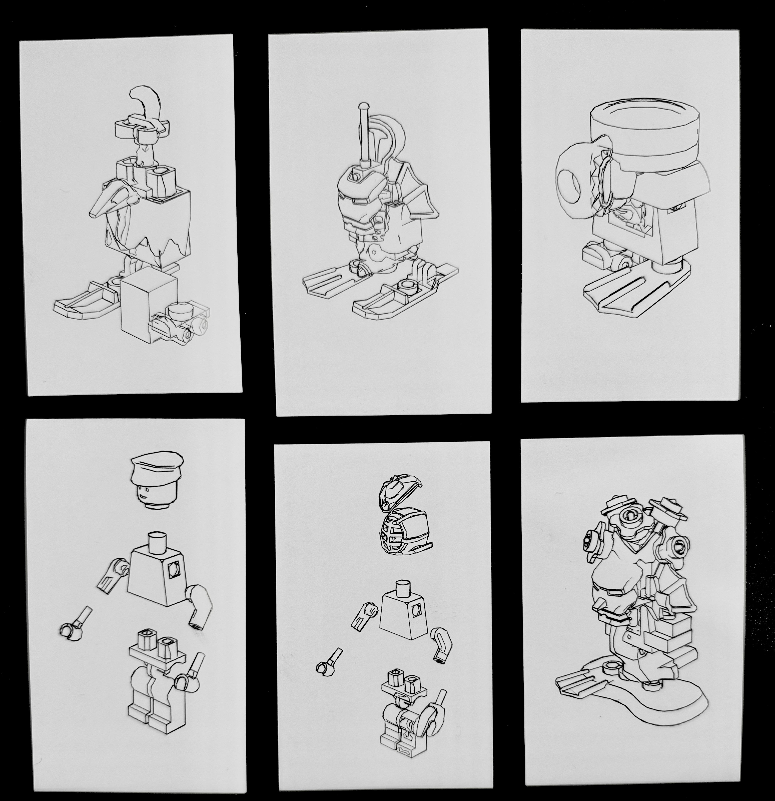
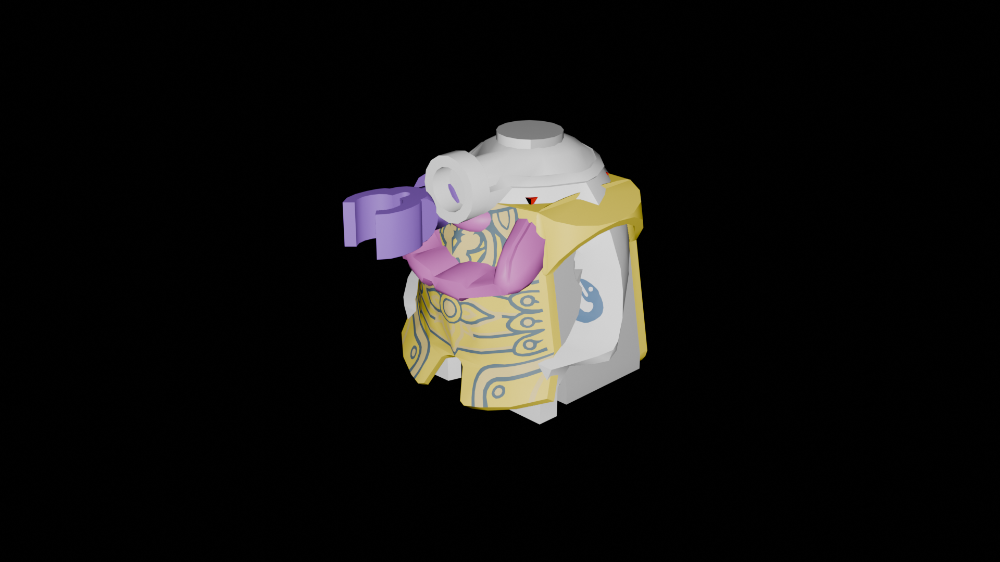
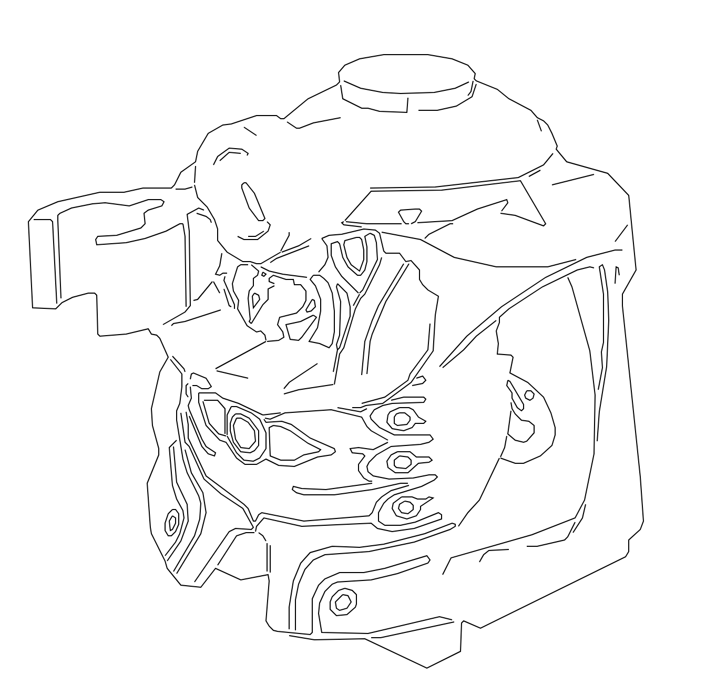
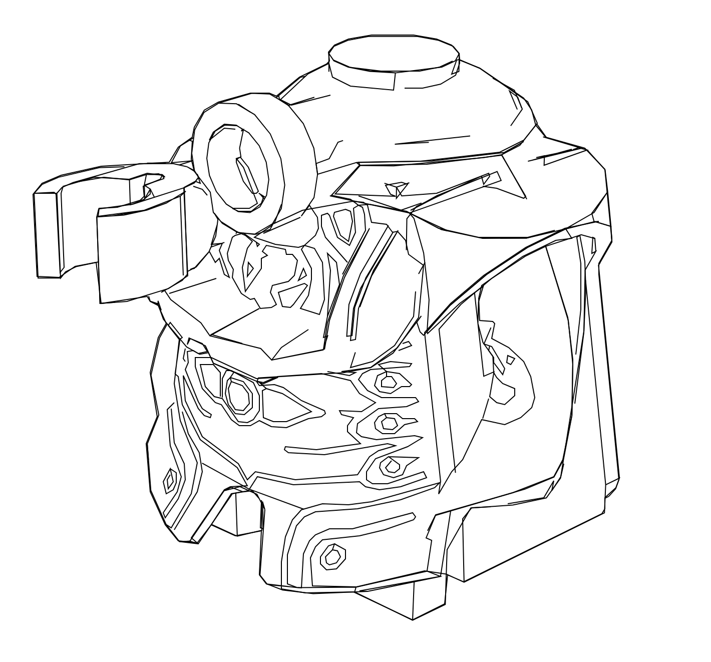
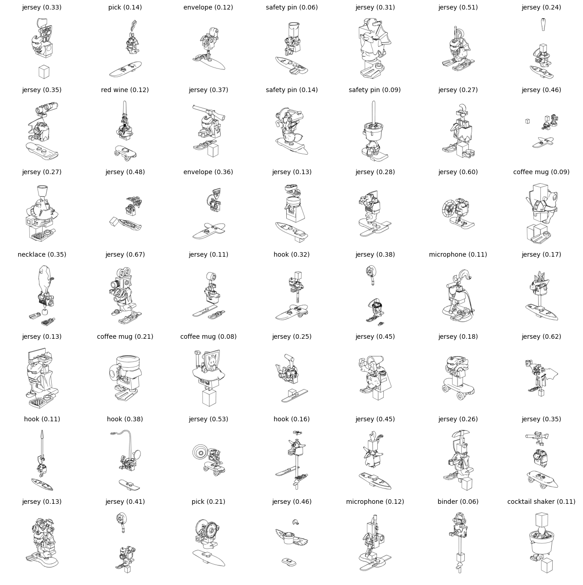
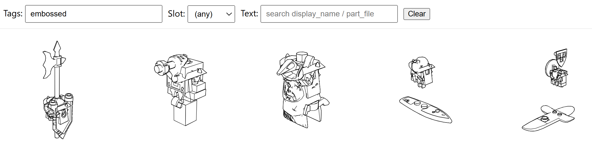

# Generative Lego Figure Pipeline
A Blender to SVG Pipeline for Lego Figures in the Official Lego Database

My investigation was a continuation of a TSNE(t-distributed stochastic neighbor embedding) distribution of the brickable dataset that I made in Generative AI. I was fascinated by the seemingly mundane modular lego pieces that created larger patterns when a larger latent space of charactering for lego was plotted as seen here. https://github.com/JeffreyYijiWang/lego_typology_video_website. Playing with legos I wanted to be able to push the standard collection of lego to include irregular shapes, conglomerations, and non-geometric shapes. Similar to how some architecture uses a repetition of shapes, I was wondering how I could represent repeating patterns of Legos and new orientations to turn a scientific tool like TSNE to be more of an artistic expression. 

## Researching Lego’s open source and proprietary software for lego building
From the brickable dataset, I was able to find LeoCAD, LDraw, LPub, LDview, and POV-Ray through which I found out that I could export 3D models from LeoCAD into blender using blender LDraw plugin.

From rendering the models in blender, I then found blenders freestyle plugin that can trace the contour and silhouette of a mesh based on the angle of the camera. A series of small tests playing with  animations, rotations, and overlapping of 3D models were conducted to explore the limitation of freestyle. 

Discoveries that were found is that I loved when I render legos that were not perfectly placed together and where colliding with each other and overlapping in investing ways. Freestyle is very good at picking up high quality edges as it uses the edges of the 3D meshes. However, freestyle does not pick up on visual textures on the lego like shadows, creases, faces,and other subtle lines that are not baked into the 3D mesh and are only a visual texture.
### Plain PNG

### Edge Detection SVG

### Freestyle Blender SVG

### Combined SVG
Utilizing the sharp edge contours and the finer details form the edge detection, I used a thicker pen and vpype line simplify to reduce noise 

### Catagorization of Images

I tried to use goggle api with mediapipe to do image classification, but I decided to take the tokens and tags from the LegoCAD library. 

### Self-Ordering-Maps vs TSNE

I first tried to used a self-ordering map which I found varying success with the organization of the legos.

I then used previous tsne_grids [t-SNE Mosaic](https://github.com/golanlevin/gen-ai/blob/main/daily_notes/0225.md) to generate a plot for 1000 legos meshes. 

### Interactive Querying 

I then sort through the lego library for potential tags and phrases to be associated with the different lego meshs. 

## Challenges 
I still need to migrate and host the server on the web instead of being hosted locally. I want to work towards predicting the movement of the lego figure. 

## Pipeline:
1. Use a lego library to set a dictionary that I can easily query Id informations about lego bricks efficiently. I used MLCad.in a open source library for the minifigure generator by Holly-Wood.it > MLCad > Newest MLCad.ini file. This process would be similar if I want to expand the pipeline to all the lego bricks. 
2. Use Generate_Minifig.py script that uses a template sections( head, neck, body, left arm, etc) for a lego figure, and randomly select lego ID’s from each section in the dictionary based on percentages I tweaked and a seed.I currently don’t have the color data associated with the minifigures so I assign contrasting colors to each brick, and apply their local rotations effects and world positions.
3. Convert the csv of lego minfigures into ldr, LEGO’s CAD file format, and then batch process them to LeoCAD and convert them into dae. Files.
4. Batch process dae files into blender
5. Create a blender scene with a camera pointing at the lego figure and a spot light illuminating the creases and geometry for later edge detection.
6. Use scripts to change the local offset, world positions, scale, and rotation of the lego models
7. Render two PNGs using blender camera: a plain render and a freestyle svg render
8. The plain render is then fed into a pixel edge detection software to capture creases and visual texture that the freestyle render will miss. The pixel edges are then converted into svg polylines and paths in the texture svg.
9. The freestyle render will capture the svg strokes while rendering the freestyle png
10. Use Vpype to merge freestyle svg and texture svg and to optimize resulting SVG
11. Use shapely and vpype to create grids and bounding boxes for each lego figure svg to then format them into grids
